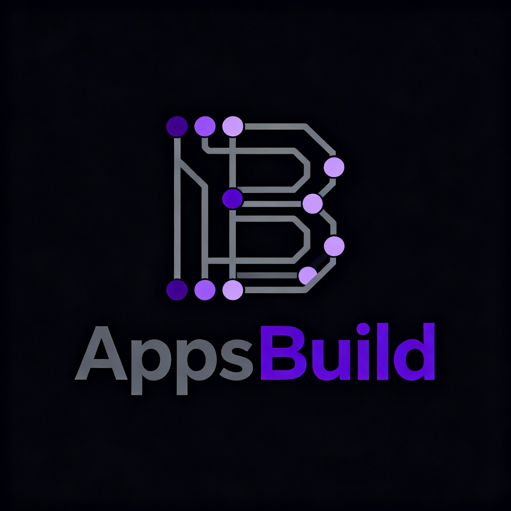

  

<h1 align="center">Careera</h1>

  <strong>AI-powered career guidance platform — analyze your profile, generate personalized learning paths, and level up your career.</strong>

  
  
  
  
  
  

---

## Vision

Careera is a collaborative open-source project built by the **AppsBuild community**. It helps users navigate their career journey using AI — upload your CV, get matched to career paths that suit your profile, and follow a structured sequence of learning modules, hands-on projects, and mock interviews, all evaluated in real time by AI.

Progress is tracked with an XP and leveling system, and users can see how they rank on a global leaderboard.

---

## Features

**🔍 AI-Driven Career Analysis**
Upload your resume and optionally upload your LinkedIn profile as a PDF, set your preferences, and let AI analyze your hard and soft skills to generate ranked career recommendations with match scores and skill gap breakdowns.

**🗺️ Personalized Learning Paths**
From any recommendation, generate a fully structured career path — a sequential chain of nodes covering learning materials, real-world projects, and interview prep. Each node unlocks only after the previous one is completed.

**⚡ Interactive Sessions**
- **Learning nodes** — AI-generated study content with key concepts and curated resources.
- **Project nodes** — Task-based coding challenges with subtask-level AI grading and feedback.
- **Interview nodes** — Q&A sessions where each answer is evaluated and scored by AI.

**🏆 Gamification**
Earn XP for completing nodes, level up your profile, and compete on a weekly, monthly, or all-time leaderboard.

**👤 Profile Management**
Update your CV, LinkedIn profile PDF, and career preferences at any time to re-run fresh analyses as you grow.

---

## Tech Stack

| Layer | Technology |
|---|---|
| Frontend | Next.js 14 (App Router), TypeScript, Tailwind CSS, Zustand (lightweight global state management for client-side UI/app state) |
| Backend | FastAPI (Python), Pydantic v2 (data validation and request/response schemas), Motor (async MongoDB driver for database access) |
| Database | MongoDB |
| AI | LLM API integration using any available provider/API key |
| Auth | Google OAuth 2.0 + JWT (access + refresh tokens) |
| Infrastructure | Docker (MongoDB container) |

---

## Documentation

| File | Contents |
|---|---|
| [docs/SETUP.md](./docs/SETUP.md) | Local setup, daily workflow, environment variables, API keys |
| [docs/TECH_SPECS.md](./docs/TECH_SPECS.md) | Database schemas, API reference, project structure |

---

## Built by AppsBuild

Careera is a team project developed within the **[AppsBuild](https://appsbuild.community)** community — a group of developers building real-world products together. Contributions, feedback, and ideas are welcome.

To get started contributing, check out the [setup guide](./docs/SETUP.md).

---

## License

MIT — see [LICENSE](./LICENSE) for details.