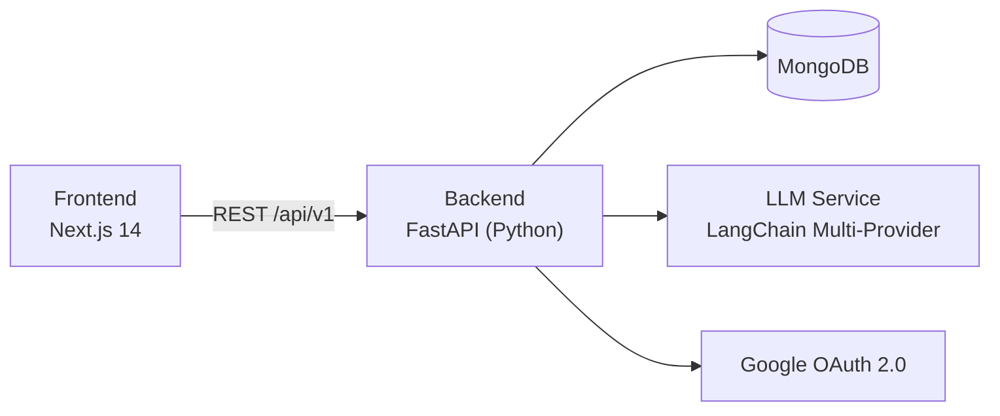

# Careera — Architecture

> This document explains **how** the system behaves.
> For decisions and reasoning, see [`DECISIONS.md`](./DECISIONS.md).

---

## Table of Contents

- [Stack](#stack)
- [Node Expansion Strategy](#node-expansion-strategy)
- [Session State Machine](#session-state-machine)
- [XP Formula](#xp-formula)
- [Last Node Detection](#last-node-detection)
- [Async Strategy](#async-strategy)
- [Security Rules](#security-rules)

---

## Stack



---

## Node Expansion Strategy

Templates are generated automatically in the background — **never as a blocking user action**.

```
Event: POST /careers/paths (path created)
  → BackgroundTask: generate Node 0's template immediately
  → node[0].linked_content_id = template._id
  → node[0].is_expanded = true  (user never sees this happen)

Event: Node N COMPLETED
  → BackgroundTask: generate Node N+1's template
  → node[N+1].linked_content_id = template._id
  → node[N+1].is_expanded = true  (user never sees this happen)

User clicks "Start" on a node:
  → is_expanded = true  → instant start (template already exists)
  → is_expanded = false → POST /expand called internally → brief loading state (rare)
```

**Look-ahead by 1:** The template for the next node is generated in the background while the user is working on the current one. By the time they finish, it's ready.

**`/expand` is not a user-facing endpoint.** It exists only as an internal fallback when look-ahead hasn't completed yet (e.g., very fast users, server restart mid-session).

---

## Session State Machine

> Applies to both `project_sessions` and `interview_sessions`. "Steps" = subtasks (projects) or questions (interviews).

```
Per step (sequential, forward-only):

  PENDING ──[submit]──→ PASSED     → step locked read-only, advance to next
  PENDING ──[submit]──→ FAILED     → retry same step (no retry limit)
  PENDING ──[forfeit]─→ FORFEITED  → score = 0, advance, LOCKED FOREVER
  FORFEITED ──[submit]──→ REJECTED (cheat guard — forfeited steps cannot be re-attempted)
```

```
Session terminal (triggered when all steps are done):

  average_score calculated across all steps
  IN_PROGRESS → PASSED    if average_score >= min_pass_score
  IN_PROGRESS → FAILED    if average_score < min_pass_score
  /abandon called          → ABANDONED (0 score, 0 XP — callable at any point)
  Terminal state reached  → any further mutation → REJECTED
```

```
Node outcome:

  Session PASSED    → node.status = COMPLETED, next node UNLOCKED, xp_gained recorded
  Session FAILED    → node stays UNLOCKED, node.attempt_number++, proportional XP awarded
  Session ABANDONED → node stays UNLOCKED, node.attempt_number++, 0 XP
```

> ⚠️ **FAILED ≠ ABANDONED.**
> FAILED = user completed all steps but scored below the pass threshold → proportional XP earned.
> ABANDONED = user quit before finishing → 0 XP, regardless of progress.

---

## XP Formula

| Node Type | EASY | MEDIUM | HARD |
|---|---|---|---|
| `LEARNING` | 30 | 50 | 75 |
| `PROJECT` | 100 | 150 | 200 |
| `INTERVIEW` | 100 | 150 | 200 |

```
LEARNING            → xp = base_xp[difficulty]                              (binary — complete = full XP)
PROJECT / INTERVIEW → xp = floor(base_xp[type][difficulty] × average_score / 100)  (proportional)
ABANDONED           → xp = 0  (always, regardless of type or progress)

Level = floor(total_xp / 500) + 1
```

| Example | Calculation | XP |
|---|---|---|
| LEARNING HARD, completed | 75 × 1.0 | **75 XP** |
| PROJECT MEDIUM, score 100 (PASSED) | 150 × 100/100 | **150 XP** |
| PROJECT MEDIUM, score 60 (FAILED) | 150 × 60/100 | **90 XP** |
| INTERVIEW HARD, score 40 | 200 × 40/100 | **80 XP** |
| Any session, ABANDONED | — | **0 XP** |

---

## Last Node Detection

```python
# At path creation:
career_paths.total_nodes = len(nodes)

# On any node COMPLETED:
if node.step == total_nodes - 1:
    career_paths.completed_at = now()   # path is done
    # → frontend shows "Path Complete" banner
    # → no bonus XP
else:
    nodes[node.step + 1].status = UNLOCKED
    # → BackgroundTask: generate node[step + 1] template
```

`completed_at != null` is the path completion signal. No new status enum value is needed.

---

## Async Strategy

| Operation | Approach |
|---|---|
| `POST /careers/analyze` | **Async** (BackgroundTasks). Returns `202 + analysis_id`, frontend polls. |
| `POST /careers/paths` | **Sync**. Fast enough for MVP. |
| Template generation (node expansion) | **Async** (BackgroundTasks). Triggered silently after path creation/node completion. |
| Session grading (`submit`) | **Sync**. User is waiting for immediate feedback. |

---

## Security Rules

- **All resources are user-scoped.** Every DB query includes `user_id = current_user._id`. A user can never read or modify another user's analyses, paths, or sessions.
- **`model_solution` and `model_answer` must never appear in any API response.** These fields are stored in templates but are stripped before returning to the client.
- **JWT tokens:** Access token (short-lived) + refresh token (long-lived, stored in MongoDB with a TTL index for automatic expiry/blacklisting). No Redis needed at demo scale.
- **Leaderboard** is the only endpoint that exposes data across users — name + avatar + XP only.
