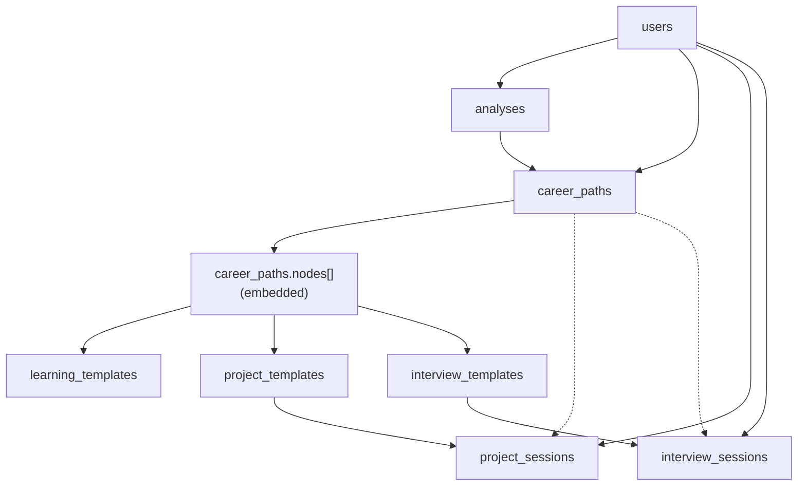

# Careera — Database Schema

> **8 MongoDB collections** · All `_id` fields are auto-generated `ObjectId`
>
> For the reasoning behind schema decisions, see [`ARCHITECTURE.md`](./ARCHITECTURE.md).

---

## Table of Contents

- [Relationships](#relationships)
- [Collections](#collections)
  - [users](#users)
  - [analyses](#analyses)
  - [career\_paths](#career_paths)
  - [learning\_templates](#learning_templates)
  - [project\_templates](#project_templates)
  - [interview\_templates](#interview_templates)
  - [project\_sessions](#project_sessions)
  - [interview\_sessions](#interview_sessions)
- [Indexes](#indexes)
- [Enum Values](#enum-values)

---

## Relationships

> Dashed arrows = `path_id` is nullable — sessions can exist outside a career path.
> Nodes are **embedded** inside `career_paths`, not a separate collection.
> `linked_content_id` on a node is polymorphic — resolved via `linked_content_collection`.

---

## Collections

### `users`

| Field | Type | Notes |
|---|---|---|
| `_id` | ObjectId | PK |
| `email` | String | **UNIQUE** |
| `name` | String | |
| `avatar` | String | URL from Google |
| `created_at` | Date | |
| `last_login` | Date | |
| `profile.cv_parsed_text` | String | Extracted from uploaded PDF |
| `profile.linkedin_parsed_text` | String | Extracted from uploaded PDF |
| `profile.interests.roles` | String[] | e.g. `["Backend Engineer"]` |
| `profile.interests.focus_areas` | String[] | e.g. `["AI", "DevOps"]` |
| `gamification.total_xp` | Number | |
| `gamification.level` | Number | `floor(total_xp / 500) + 1` |

---

### `analyses`

| Field | Type | Notes |
|---|---|---|
| `_id` | ObjectId | PK |
| `user_id` | ObjectId | → `users._id` |
| `created_at` | Date | |
| `status` | Enum | `PENDING` \| `READY` \| `FAILED` — for async polling |
| `profile_insight.summary` | String | LLM-generated |
| `profile_insight.hard_skills` | String[] | |
| `profile_insight.soft_skills` | String[] | |
| `recommendations[].rec_index` | Number | |
| `recommendations[].title` | String | Career title |
| `recommendations[].description` | String | |
| `recommendations[].match_score` | Number | 0–100 |
| `recommendations[].reasoning` | String | |
| `recommendations[].missing_skills` | String[] | |
| `recommendations[].tags` | String[] | |
| `recommendations[].is_expanded` | Boolean | `true` once a path was generated from this recommendation |
| `recommendations[].linked_path_id` | ObjectId | → `career_paths._id` (null if not expanded) |

> `profile_insight` and `recommendations` are only populated when `status = READY`.

---

### `career_paths`

| Field | Type | Notes |
|---|---|---|
| `_id` | ObjectId | PK |
| `user_id` | ObjectId | → `users._id` |
| `analysis_id` | ObjectId | → `analyses._id` |
| `recommendation_index` | Number | Which recommendation generated this path |
| `title` | String | |
| `description` | String | |
| `tags` | String[] | |
| `missing_skills` | String[] | |
| `status` | Enum | `ACTIVE` \| `ARCHIVED` \| `DELETED` |
| `deleted_at` | Date | Only set when `status = DELETED` |
| `completed_at` | Date | Set when the last node is completed — `null` until then |
| `total_nodes` | Number | Set at creation = `len(nodes[])` — used for last-node detection |
| `created_at` | Date | |
| `nodes` | Object[] | **Embedded array** — see `nodes` table below |

#### `career_paths.nodes[]`

| Field | Type | Notes |
|---|---|---|
| `step` | Number | 0-indexed sequence |
| `title` | String | |
| `description` | String | |
| `type` | Enum | `LEARNING` \| `PROJECT` \| `INTERVIEW` |
| `difficulty` | Enum | `EASY` \| `MEDIUM` \| `HARD` |
| `tags` | String[] | |
| `status` | Enum | `LOCKED` \| `UNLOCKED` \| `COMPLETED` |
| `is_expanded` | Boolean | `true` after template has been generated |
| `linked_content_id` | ObjectId | → `*_templates._id` (polymorphic) |
| `linked_content_collection` | String | `"learning_templates"` \| `"project_templates"` \| `"interview_templates"` — must match `type` |
| `max_score` | Number | |
| `attempts` | Number | Incremented on each session FAILED or ABANDONED |
| `xp_gained` | Number | XP earned on most recent completion |
| `completed_at` | Date | |

> ⚠️ Node `step = 0` starts `UNLOCKED`. All others start `LOCKED` until the previous is `COMPLETED`.

---

### `learning_templates`

| Field | Type | Notes |
|---|---|---|
| `_id` | ObjectId | PK |
| `title` | String | |
| `description` | String | |
| `difficulty` | Enum | `EASY` \| `MEDIUM` \| `HARD` |
| `tags` | String[] | |
| `estimated_duration` | String | Human-readable, e.g. `"2 hours"` |
| `estimated_minutes` | Number | |
| `content.intro_summary` | String | |
| `content.key_concepts[]` | Object[] | `{ concept, description, why_learn }` |
| `content.resources[]` | Object[] | `{ label, url }` |
| `created_at` | Date | |

---

### `project_templates`

| Field | Type | Notes |
|---|---|---|
| `_id` | ObjectId | PK |
| `title` | String | |
| `difficulty` | Enum | `EASY` \| `MEDIUM` \| `HARD` |
| `tags` | String[] | |
| `min_pass_score` | Number | 0–100 |
| `estimated_duration` | String | |
| `estimated_minutes` | Number | |
| `total_tasks` | Number | |
| `total_subtasks` | Number | |
| `created_at` | Date | |
| `tasks[].task_index` | Number | |
| `tasks[].title` | String | |
| `tasks[].description` | String | |
| `tasks[].subtasks[].subtask_index` | Number | |
| `tasks[].subtasks[].title` | String | |
| `tasks[].subtasks[].description` | String | |
| `tasks[].subtasks[].acceptance_criteria` | String | |
| `tasks[].subtasks[].hint` | String | |
| `tasks[].subtasks[].model_solution` | String | 🔒 **NEVER return to client** |

---

### `interview_templates`

| Field | Type | Notes |
|---|---|---|
| `_id` | ObjectId | PK |
| `title` | String | |
| `difficulty` | Enum | `EASY` \| `MEDIUM` \| `HARD` |
| `tags` | String[] | |
| `estimated_duration` | String | |
| `estimated_minutes` | Number | |
| `min_pass_score` | Number | 0–100 |
| `total_questions` | Number | |
| `created_at` | Date | |
| `questions[].question_index` | Number | |
| `questions[].text` | String | |
| `questions[].hint` | String | |
| `questions[].model_answer` | String | 🔒 **NEVER return to client** |

---

### `project_sessions`

| Field | Type | Notes |
|---|---|---|
| `_id` | ObjectId | PK |
| `user_id` | ObjectId | → `users._id` |
| `template_id` | ObjectId | → `project_templates._id` |
| `path_id` | ObjectId | → `career_paths._id` — **nullable** |
| `node_step` | Number | Which node triggered this session |
| `status` | Enum | `IN_PROGRESS` \| `PASSED` \| `FAILED` \| `ABANDONED` |
| `current_task_index` | Number | Server-tracked — not client-supplied |
| `current_subtask_index` | Number | Server-tracked — not client-supplied |
| `average_score` | Number | 0–100 average across all subtasks |
| `xp_earned` | Number | |
| `attempt_number` | Number | |
| `started_at` | Date | |
| `completed_at` | Date | |
| `expires_at` | Date | Frontend-driven timeout |
| `duration_seconds` | Number | |
| `tasks[].task_index` | Number | |
| `tasks[].status` | Enum | `PENDING` \| `IN_PROGRESS` \| `COMPLETED` |
| `tasks[].subtasks[].subtask_index` | Number | |
| `tasks[].subtasks[].user_submission` | String | Code submitted by user |
| `tasks[].subtasks[].score` | Number | 0–100, LLM-assigned |
| `tasks[].subtasks[].status` | Enum | `PENDING` \| `PASSED` \| `FAILED` \| `FORFEITED` |
| `tasks[].subtasks[].feedback` | String | LLM-generated |

---

### `interview_sessions`

| Field | Type | Notes |
|---|---|---|
| `_id` | ObjectId | PK |
| `user_id` | ObjectId | → `users._id` |
| `template_id` | ObjectId | → `interview_templates._id` |
| `path_id` | ObjectId | → `career_paths._id` — **nullable** |
| `node_step` | Number | |
| `status` | Enum | `IN_PROGRESS` \| `PASSED` \| `FAILED` \| `ABANDONED` |
| `current_question_index` | Number | Server-tracked — not client-supplied |
| `average_score` | Number | 0–100 average across all answers |
| `xp_earned` | Number | |
| `attempt_number` | Number | |
| `started_at` | Date | |
| `completed_at` | Date | |
| `expires_at` | Date | Frontend-driven timeout |
| `duration_seconds` | Number | |
| `answers[].question_index` | Number | |
| `answers[].user_answer` | String | |
| `answers[].score` | Number | 0–100, LLM-assigned |
| `answers[].feedback` | String | LLM-generated |
| `answers[].status` | Enum | `PENDING` \| `ANSWERED` \| `SKIPPED` |

---

## Indexes

| Collection | Fields | Type |
|---|---|---|
| `users` | `email` | UNIQUE |
| `analyses` | `user_id` | — |
| `analyses` | `created_at` desc | — |
| `career_paths` | `user_id` | — |
| `career_paths` | `status` | — |
| `career_paths` | `analysis_id` | — |
| `learning_templates` | `tags` | — |
| `learning_templates` | `difficulty` | — |
| `project_templates` | `tags` | — |
| `project_templates` | `difficulty` | — |
| `interview_templates` | `tags` | — |
| `interview_templates` | `difficulty` | — |
| `project_sessions` | `user_id` | — |
| `project_sessions` | `template_id` | — |
| `project_sessions` | `status` | — |
| `project_sessions` | `path_id` | — |
| `interview_sessions` | `user_id` | — |
| `interview_sessions` | `template_id` | — |
| `interview_sessions` | `status` | — |
| `interview_sessions` | `path_id` | — |
| `*_sessions` | `expires_at` | TTL (for session expiry cleanup) |

> The refresh token collection (managed by the `auth` domain) also uses a **TTL index** on `expires_at` for automatic blacklist cleanup.

---

## Enum Values

| Field | Values |
|---|---|
| `analyses.status` | `PENDING`, `READY`, `FAILED` |
| `career_paths.status` | `ACTIVE`, `ARCHIVED`, `DELETED` |
| `nodes.type` | `LEARNING`, `PROJECT`, `INTERVIEW` |
| `nodes.status` | `LOCKED`, `UNLOCKED`, `COMPLETED` |
| `nodes.difficulty` | `EASY`, `MEDIUM`, `HARD` |
| `*_sessions.status` | `IN_PROGRESS`, `PASSED`, `FAILED`, `ABANDONED` |
| `project_sessions.tasks[].status` | `PENDING`, `IN_PROGRESS`, `COMPLETED` |
| `project_sessions.subtasks[].status` | `PENDING`, `PASSED`, `FAILED`, `FORFEITED` |
| `interview_sessions.answers[].status` | `PENDING`, `ANSWERED`, `SKIPPED` |
