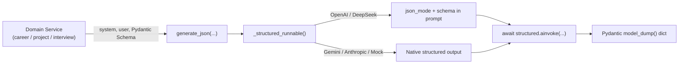

# 🤖 LLM Integration Guide

Careera provides a **provider-agnostic, async LLM generation layer** built on top of [LangChain](https://python.langchain.com/) and [Pydantic v2](https://docs.pydantic.dev/).

It allows developers to write LLM tasks once and switch seamlessly between offline mock responses (zero cost) and production cloud providers (Gemini, DeepSeek, OpenAI, Anthropic).

---

## ⚡ Quick Start: Using LLM in Services

Every LLM call in Careera follows a standard 3-step pattern using [`generate_json()`](../backend/app/share/service/llm/__init__.py):

```python
from pydantic import BaseModel, Field
from app.share.service.llm import generate_json

# 1. Define the target JSON structure with Pydantic
class ProfileAnalysisOutput(BaseModel):
    summary: str = Field(description="2-3 sentence overview of candidate profile")
    hard_skills: list[str] = Field(default_factory=list)
    match_score: int = Field(ge=0, le=100)

# 2. Call generate_json asynchronously
async def analyze_profile(cv_text: str) -> dict:
    result = await generate_json(
        system="You are an expert technical career counselor.",
        user=f"Analyze this CV:\n{cv_text}\nReturn JSON matching the 'career analysis' schema.",
        response_model=ProfileAnalysisOutput,
    )
    
    # 3. Use the guaranteed valid dictionary (ready for MongoDB)
    # result = {"summary": "...", "hard_skills": ["Python", "FastAPI"], "match_score": 92}
    return result
```

---

## 🏗️ How It Works



### Key Guarantees:
1. **Fully Async (`ainvoke`)**: Never blocks FastAPI's event loop during long generation calls.
2. **Strict Schema Validation**: Responses are validated against the Pydantic model before returning. If the LLM generates invalid data, an [`LLMProviderError`](../backend/app/share/service/llm/exceptions.py) is raised.
3. **Provider Compatibility**: Normalizes API differences across vendors (e.g. automatically handling DeepSeek's `json_mode` requirements).

---

## ⚙️ Environment Configuration

Configure the provider in `backend/.env`:

| Variable | Required | Default | Description |
|---|---|---|---|
| `LLM_PROVIDER` | No | `mock` | `mock` \| `gemini` \| `deepseek` \| `openai` \| `anthropic` |
| `LLM_API_KEY` | When not `mock` | `""` | API key for the selected cloud provider |
| `LLM_MODEL` | No | *Provider default* | Model override (e.g. `gemini-1.5-flash`, `deepseek-chat`) |
| `LLM_URL` | No | `""` | Base URL override (useful for DeepSeek proxies or local Ollama) |

### Setup Examples

#### 1. Local Development (Default — Zero Cost, No API Key)
```env
LLM_PROVIDER=mock
```

#### 2. Google Gemini (Fast & Cost-Effective)
```env
LLM_PROVIDER=gemini
LLM_API_KEY=AIzaSy...
LLM_MODEL=gemini-1.5-flash
```

#### 3. DeepSeek (Low-Cost)
```env
LLM_PROVIDER=deepseek
LLM_API_KEY=sk-...
LLM_MODEL=deepseek-chat
LLM_URL=https://api.deepseek.com
```

#### 4. Local Ollama / Self-Hosted
```env
LLM_PROVIDER=openai
LLM_API_KEY=ollama
LLM_URL=http://localhost:11434/v1
LLM_MODEL=llama3
```

---

## 🧪 Adding Mock Data for New Features

When building a new domain feature (e.g., Feature 4 Project Grading or Feature 5 Interview Questions), register a mock response so your feature works offline without API keys:

1. Open [`backend/app/share/service/llm/mock.py`](../backend/app/share/service/llm/mock.py).
2. Add your canned JSON factory function:
   ```python
   def _project_evaluation() -> dict[str, Any]:
       return {
           "status": "PASSED",
           "score": 85,
           "feedback": "Clean modular code with solid test coverage."
       }
   ```
3. Register your trigger keyword in `_PROMPT_MARKERS`:
   ```python
   _PROMPT_MARKERS: dict[str, Callable[[], dict[str, Any]]] = {
       "career analysis": _career_analysis,
       "career path": _career_path,
       "project evaluation": _project_evaluation,  # ← Added marker
   }
   ```
4. Include that keyword phrase in your service's user or system prompt.

---

## 🚦 Testing

* **Fast Mock Unit Tests (Default)**:
  ```bash
  poetry run pytest
  ```
* **Live Integration Tests (Real API Calls)**:
  ```bash
  LLM_PROVIDER=gemini LLM_API_KEY=your_key poetry run pytest -m integration -s
  ```
